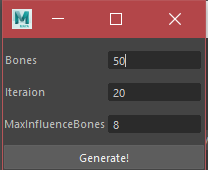

# SSDR4Maya

A UI Version for TomohikoMukai's original [SSDR4maya](https://github.com/TomohikoMukai/ssdr4maya)

### How to Use

- Clone the Project
- In Maya, Go to Windows->Setting/Perferences->Plug-in Manager, Click the 'Browse' Button, select 'mlSsdrBuilder.py' in 'bin' folder  